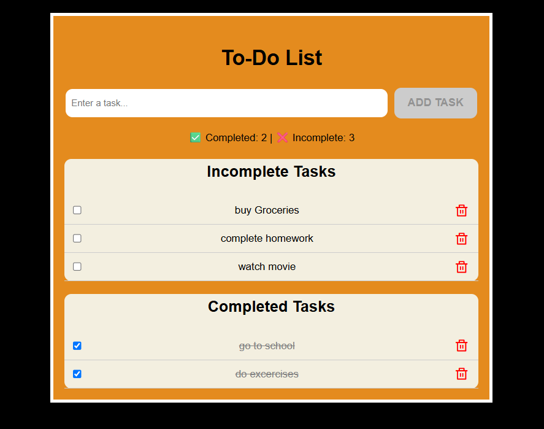

# 📝 Vue.js ToDo List

A simple and responsive ToDo List application built with Vue.js. This project allows users to add, delete, and mark tasks as completed. It demonstrates the fundamentals of Vue.js such as components, directives, and reactive data handling.

## 🚀 Features

- Add new tasks
- Mark tasks as completed
- Delete individual tasks
- Responsive and clean UI
- Persistent data using localStorage (optional)

## 🖼️ Demo



## 🛠️ Built With

- [Vue.js](https://vuejs.org/) (version 3 or 2 — specify your version)
- HTML5, CSS3, JavaScript

## 📦 Installation

```bash
# Clone the repository
git clone https://github.com/yourusername/vue-todo-list.git
cd vue-todo-list

# Install dependencies
npm install

# Run the app locally
npm run serve
